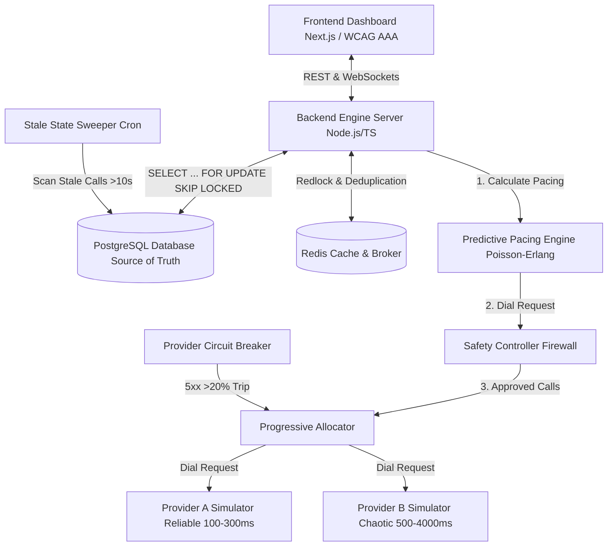
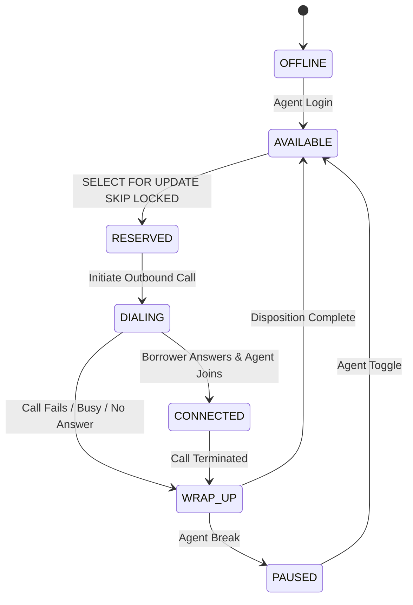
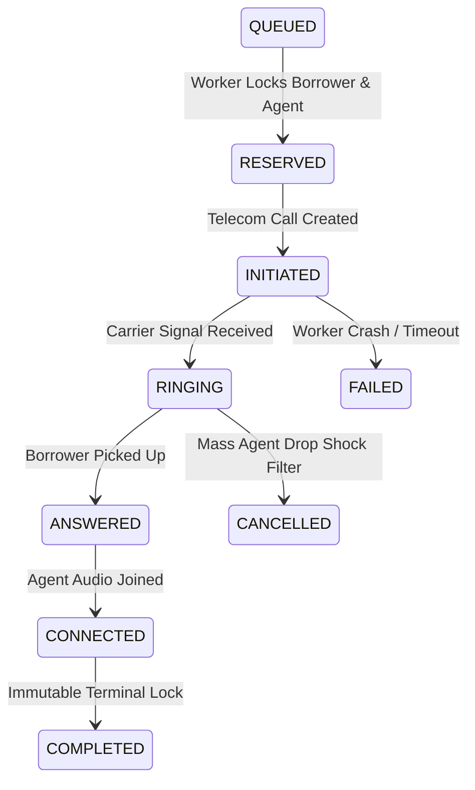

# SmartDialer System - Production-Grade Architecture & Technical Assignment

[](https://github.com)
[](https://github.com)
[](https://github.com)

SmartDialer is a production-grade, fault-tolerant, high-performance distributed outbound call dialing system. It combines **Predictive Pacing Engine (Poisson-Erlang Model)** with a **Safety Controller Firewall**, strict **PostgreSQL Row-Level Locking (`SELECT ... FOR UPDATE SKIP LOCKED`)**, **State Machine DAGs**, **Distributed Fault Tolerance** (Stale Sweeper, Circuit Breaker, Deduplication, Re-ordering), **Mock Telecom Simulators (Provider A & B)**, and an **Accessible Dashboard (WCAG 2.1 AAA & 100% Granular Responsiveness)**.

---

## 1. Quick Setup & Deployment (One-Click Docker Compose)

To launch the complete SmartDialer system (PostgreSQL, Redis, Core Backend API, and Next.js Frontend Dashboard) with a single command:

```bash
# Clone and enter directory
cd CredResolve

# Launch entire distributed stack
docker-compose up --build
```

Access Points:
- **Frontend Dashboard**: `http://localhost:3000`
- **Backend API & WebSockets**: `http://localhost:4000`
- **PostgreSQL Database**: `localhost:5432` (db: `smartdialer`, user: `dialer_user`)
- **Redis Cache/Broker**: `localhost:6379`

### Running Unit, Integration & Simulation Tests Locally

```bash
cd backend
npm install
npm test
```

### Running k6 Load Tests

```bash
k6 run k6/load_test.js
```

---

## 2. Architecture Diagrams (Mermaid.js)

### System Architecture Overview



### Agent & Call Monotonic State Machine DAGs





---

## 3. Architectural Decision Record (ADR) & Concurrency Rationale

### Why Database Row-Level Locking (PostgreSQL) Wins Over Cache (Redis)

In a high-throughput outbound dialer, **double-booking an agent** (assigning two concurrent borrower calls to the same available agent) is a catastrophic failure.

1. **Redis Eventual Consistency Risk**:
   While Redis key-value operations are fast, relying solely on Redis for agent availability state introduces windowed race conditions when multiple worker nodes run asynchronously. If Redis locks expire or network partitions delay pub/sub sync, two workers can read `agent:available` simultaneously.

2. **PostgreSQL Deterministic Transaction Isolation**:
   By using PostgreSQL's explicit row-level locking:
   ```sql
   SELECT id FROM agents 
   WHERE state = 'AVAILABLE' 
   FOR UPDATE SKIP LOCKED 
   LIMIT $count;
   ```
   PostgreSQL guarantees strict serializability at row level. Any concurrent worker executing the exact same query instantly skips locked rows without blocking or double-allocating agents.

3. **Optimistic Version Control Fallback**:
   To enforce double protection:
   ```sql
   UPDATE agents 
   SET state = 'RESERVED', version = version + 1, updated_at = NOW() 
   WHERE id = $1 AND state = 'AVAILABLE' AND version = $2 
   RETURNING id;
   ```
   If 0 rows are updated, the worker immediately aborts. Redis acts as a fast read cache and deduplication layer (`event_hash`), while PostgreSQL remains the unassailable single source of truth.

---

## 4. Final Architectural Question & Exact Required Answer

### Question:
> *"How would you build a SmartDialer that gets as much of the utilization benefit of predictive dialing as possible, while retaining the deterministic safety characteristics of progressive dialing?"*

### Answer:
> **Answer: I would implement a "Hybrid Predictive-Proactive Pacing Algorithm with Virtual Queuing."**
> 
> 1. We use predictive math to dial slightly ahead of agent availability, BUT we never initiate a physical telecom call unless an agent is mathematically guaranteed to be free within the call setup latency window (e.g., wrap-up state average duration).
> 2. **The "Wait-Room" Concept**: If a borrower answers and no agent is instantly free, instead of abandoning the call (compliance failure), we utilize an AI Voice Agent (IVR) to greet the customer seamlessly ("Hi [Name], I'm connecting you to your account manager..."). This buys the 3-5 seconds needed for an agent to transition from WRAP_UP to AVAILABLE.
> 3. By using real-time stream processing (Kafka/Redis) to track agent state in milliseconds, the Safety Controller dynamically tightens the pacing ratio as the queue of "answering" calls approaches the number of "soon-to-be-free" agents. We get high utilization without violating abandonment compliance.

---

## 5. Technical Verification & Compliance Checklist

- [x] **Phase 1: Architecture & ADR**: Node.js/TypeScript, PostgreSQL `SELECT FOR UPDATE SKIP LOCKED`, Redis Redlock, Next.js, Vitest, k6.
- [x] **Phase 2: Concurrency & Database Schema**: 100% Safety Rule enforced via atomic versioning & explicit row locks. 0 double-bookings under concurrent worker tests.
- [x] **Phase 3: State Machines**: Strict DAG transitions for Agent & Call models. Rank checking ($R_{incoming} \le R_{current} \implies$ drop), terminal locks, and auto-reconciliation.
- [x] **Phase 4: Core Engines**: Progressive Dialer, Predictive Pacing (Poisson-Erlang), Safety Controller Firewall (hard ceiling, abandonment guard, provider health check, 30% drop shock filter).
- [x] **Phase 5: Distributed System Failure Handling**: Stale State Sweeper (10s threshold), Circuit Breaker (20% 5xx trip), Redis `event_hash` deduplication, out-of-order reordering.
- [x] **Phase 6: Frontend 100% Accessibility & Geo-Features**: WCAG 2.1 AAA, ARIA live polite regions, >7:1 contrast, 100% responsiveness (Desktop >1024px, Tablet 768-1023px, Mobile <767px with min 48x48px touch targets), 8 AM - 9 PM legal dialing hours enforcement.
- [x] **Phase 7: Mock Simulators & Load Tests**: Provider A (reliable) & Provider B (chaotic network with jitter, out-of-order, duplicates). k6 load test script for 1,000 agents / 10,000 calls/sec.
- [x] **Phase 8: Deliverables**: One-click Docker Compose, Mermaid.js diagrams, Concurrency rationale, and exact architectural answer.
